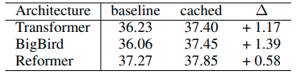

# Cached Transformers
This annoymous repo contains introductions and codes of paper "Cached Transformers: Improving Vision Transformers with Differentiable Memory Cache ".
 

## Introduction
In this work, we propose a novel family of Transformer model, called Cached Transformer, which has a gated recurrent caches (GRC), a lightweight and flexible widget enabling Transformers to access the historical knowledge.

#### Behavior
We look into this behavior in image classification and find that GRC can separate features into two parts, attending over caches yielding instance-invariant 
features, as well as attending over self yielding instance-specific features (See visualizations Below}).

#### Results
 We conduct extensive experiments on more than **ten** representative Transformer networks from both vision and language tasks, including long range arena, image classification, object detection, instance segmentation, and machine translation. The results demonstrate that our approach significantly improves performance of recent Transformers. 
 
  

##### ImageNet Results

##### COCO2017 Results (Mask R-CNN 1x)

##### COCO2017 Results (RetinaNet 1x)

##### LRA Results

##### Machine Translation Results

## Methods

#### Cached Attention with GRC (GRC-Attention)

The illustration of proposed GRC-Attention in Cached Transformers. 
 
(a) Details of the updating process of Gated Recurrent Cache. The updated cache $C_t$ is derived based on  current tokens $X_t$ and cache of last step $C_{t-1}$.  The reset gates $g_r$ reset the previous cache $C_{t-1}$ to reset cache $C_t$, and the update gates $g_u$ controls the update intensity.  

(b) Overall pipeline of GRC-Attention. Inputs will attend over cache and themselves respectively, and the outputs are formulated as interpolation of the two attention results. 

## Anaylysis

#### Significance of Cached Attention

To verify that the above performance gains mainly come from attending over caches, we analyze the contribution of $o_{mem}$ by visualizing the learnable attention ratio $\sigma(\lambda^h)$. 
Hence,  $\sigma(\lambda^h)$ can be used to represent the relative significance of $o_{mem}^h$ and $o_{self}^h$.
We observe that, for more than half of the layers,  $\sigma(\lambda^h)$ is larger than $0.5$, denoting that outputs of those layers are highly dependent on the cached attention. 
Besides, we also notice an interesting fact that the models always prefer more cached attention except for the last several layers.

#### Roles of Cached Attention

We investigate the function of GRC-Attention by visualizing their interior feature maps. 
We choose the middle layers of cached ViT-S, averaging the  outputs from self-attention $o_{self}$ and cached attention ($o_{mem}$) across the head and channel dimension, and then normalizing them into $[0, 1]$. 
The corresponding results are denoting as $o_{self}$ and $o_{mem}$, respectively. 
As $o_{self}$ and $o_{mem}$  are sequences of patches,  they are unflattened to $14 \times 14$ shape for better comparison.
As shown, Features derived by the above two attentions are visually complementary.  

In GRC-Attention, $o_{mem}$ is derived by attending over the proposed cache (GRC) containing compressive representations of historical samples, and thus being adept in recognizing **public** and frequently showing-up patches of this **class**. 
While for $o_{self}$ from self-attention branch, it can focus on finding out more private and **characteristic** features of the input **instance**. 
With above postulates, we can attempt to explain the regularity of $\sigma(\lambda^h)$: employing more $o_{mem}$ (larger $\sigma(\lambda^h)$ ) in former layers can help the network to distinguish this instance coarsely, and employing more $o_{self}$ (smaller $\sigma(\lambda^h)$) enable the model to make fine-grained decision.

## Core Codes
The pytorch implementation of GRC-Attention module is provided in "core" directory. 
Full training and testing codes will be released later. 

